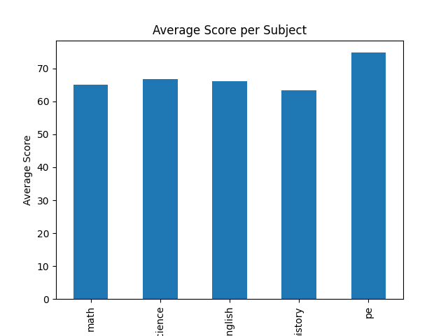
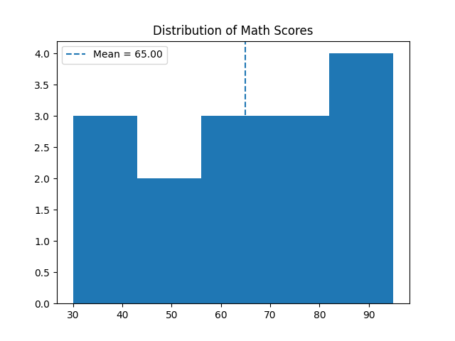
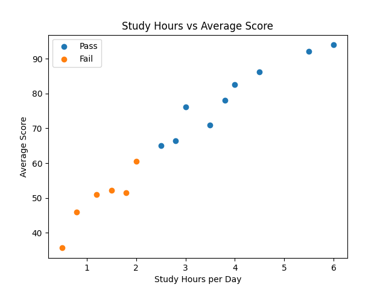
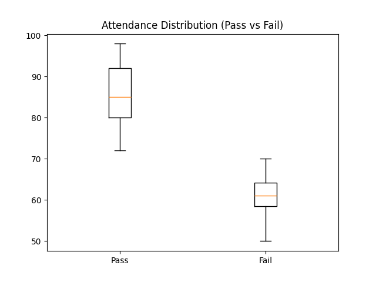
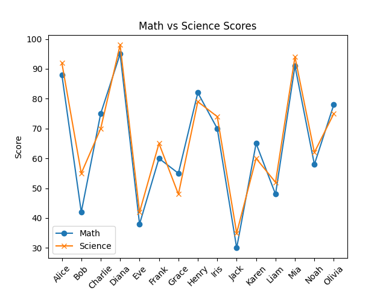
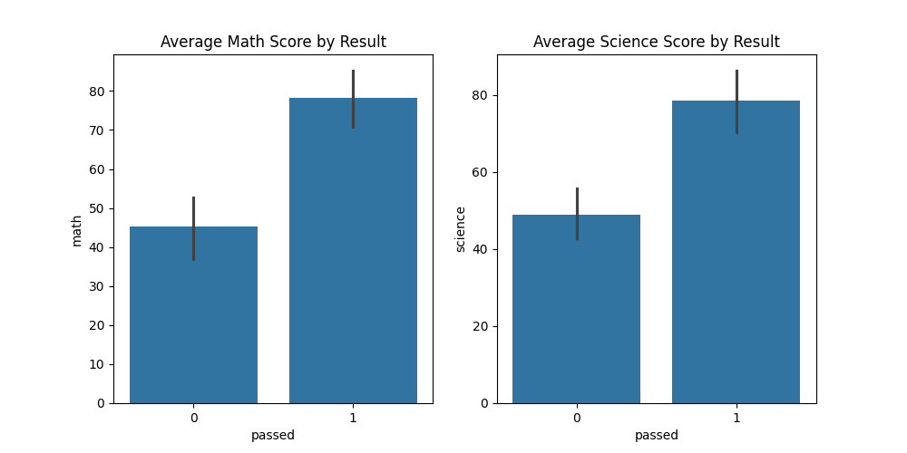
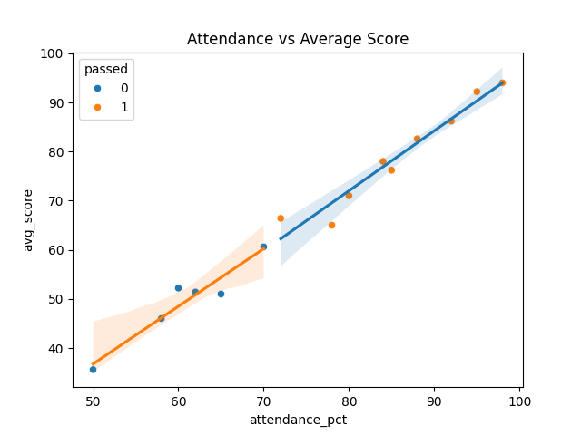

# 📊 Student Performance Analysis & Prediction

## 🚀 Overview

This project analyzes student performance data and builds a machine learning model to predict whether a student will pass or fail.

It follows a complete data workflow:
- Data exploration
- Visualization
- Model building
- Prediction

---

## 📁 Dataset

File: `students.csv`

The dataset includes:
- Academic scores (Math, Science, English, History, PE)
- Attendance percentage
- Study hours per day
- Final result (`passed`: 1 = Pass, 0 = Fail)

---

## 🔍 Data Exploration

Performed using **pandas**:
- Viewed dataset structure and summary statistics
- Compared passing vs failing students
- Identified top-performing student based on average score

---

## 📊 Visualizations

### 📌 Average Score per Subject


### 📌 Math Score Distribution


### 📌 Study Hours vs Average Score


### 📌 Attendance Comparison (Pass vs Fail)


### 📌 Math vs Science Performance


---

## 🎨 Seaborn Visualizations

### 📌 Subject Scores by Result


### 📌 Attendance vs Performance (with Regression)


---

## 🤖 Machine Learning Model

Model used: **Logistic Regression**

### Features:
- Subject scores
- Attendance percentage
- Study hours

### Steps:
- Data split (80% train / 20% test)
- Feature scaling using `StandardScaler`
- Model training
- Accuracy evaluation

---

## 📈 Feature Importance

- Extracted model coefficients
- Ranked features based on impact

Interpretation:
- Positive → increases chance of passing  
- Negative → increases chance of failing  

---

## 🧪 Prediction (New Student)

The model predicts:
- Pass/Fail outcome  
- Probability score  

---

## ⚙️ How to Run

### Install dependencies
```bash
pip install pandas matplotlib seaborn scikit-learn
